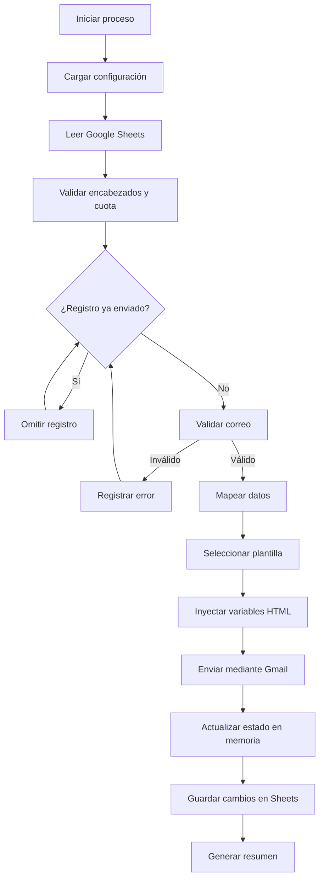

# ✉️ Sistema Multiplantillas para Notificaciones por Correo

[](https://developers.google.com/apps-script) [](https://www.gmail.com/) [](https://sheets.google.com) [](https://developer.mozilla.org/docs/Web/HTML)

Sistema para la **generación, personalización y envío masivo de notificaciones HTML**, desarrollado sobre **Google Apps Script, Google Sheets, Gmail y plantillas HTML compatibles con clientes de correo**.

El sistema permite seleccionar diferentes tipos de comunicación, consultar los registros de una hoja de cálculo, generar el contenido dinámico de cada correo, enviarlo mediante Gmail y actualizar el estado de cada fila para evitar envíos duplicados.

---

## 📑 Índice

- 🚀 [Funcionalidades](#-funcionalidades)
- 🔄 [Flujo de Funcionamiento](#-flujo-de-funcionamiento)
- 🧩 [Plantillas Disponibles](#-plantillas-disponibles)
- 🗄️ [Estructura de Datos](#️-estructura-de-datos)
- ⚙️ [Instalación y Configuración](#️-instalación-y-configuración)
- 📧 [Envío de Correos](#-envío-de-correos)
- 🧱 [Arquitectura del Código](#-arquitectura-del-código)
- 📁 [Estructura del Proyecto](#-estructura-del-proyecto)
- 🔐 [Validaciones y Seguridad](#-validaciones-y-seguridad)
- 🛠️ [Pruebas](#️-pruebas)
- 🌐 [Uso en Google Apps Script](#-uso-en-google-apps-script)
- 🎯 [Resultado](#-resultado)
- 🔧 [Tecnologías Utilizadas](#-tecnologías-utilizadas)

---

## 🚀 Funcionalidades

### 📬 Generación de Correos Personalizados

Cada correo se construye a partir de la información de una fila de Google Sheets. El sistema reemplaza marcadores como `%%SALUDO_NOMBRE%%`, `%%PARRAFO_1%%` y `%%URL_BOTON_PAGO%%` dentro de la plantilla HTML.

Los textos, títulos, colores, banners y enlaces se gestionan de forma centralizada para que puedan modificarse sin alterar el motor principal.

### 📨 Envío Masivo desde Google Sheets

El proceso lee todas las filas de la hoja, valida la dirección de correo y envía únicamente los registros que todavía no aparecen como enviados.

El envío utiliza `GmailApp.sendEmail()` con:

- Cuerpo HTML.
- Texto alternativo para clientes sin soporte HTML.
- Nombre visible del remitente.
- Copia (`cc`).
- Copia oculta (`bcc`).
- Dirección de respuesta (`replyTo`).
- Alias autorizado (`from`).
- Archivos adjuntos desde Google Drive.
- Imágenes embebidas mediante `inlineImages`.
- Opción `noReply` cuando está disponible para la cuenta.

### 🔁 Control de Idempotencia

Antes de enviar un correo, el sistema revisa la columna `Enviado`. Se omiten los registros cuyo valor sea:

- `TRUE`
- `SI`
- `true`

Después de un envío exitoso, la fila se actualiza con el valor configurado, por defecto `SI`.

### 📊 Procesamiento por Lotes

La información se lee una sola vez desde Google Sheets y los cambios se escriben en una sola operación al finalizar. Esto reduce llamadas a los servicios de Apps Script y mejora el rendimiento.

### 🧾 Registro de Errores y Auditoría

El sistema registra eventos de ejecución, correos enviados, filas omitidas y errores encontrados. La función de envío devuelve un resumen con:

- Total de filas.
- Correos enviados exitosamente.
- Registros omitidos por haber sido enviados.
- Cantidad de errores.
- Detalle de los errores por fila.

---

## 🔄 Flujo de Funcionamiento



---

## 🧩 Plantillas Disponibles

La plantilla activa se selecciona en `Configuracion.gs`, dentro de `CONFIGURACION_BD.PLANTILLA_ACTIVA`.

| Clave | Uso | Archivo HTML |
|---|---|---|
| `financiacionVencimiento` | Recordatorio de una cuota que vence | `PlantillaNotifiacionGeneral.html` |
| `financiacionPendientepago` | Aviso de saldo pendiente | `PlantillaNotifiacionGeneral.html` |
| `financiacionCancelada` | Aviso de cancelación de financiación | `PlantillaFinanciacionCancelada.html` |
| `evitePerdidaProteccion` | Aviso preventivo de pérdida de cobertura | `PlantillaNotifiacionGeneral.html` |

> El nombre `PlantillaNotifiacionGeneral.html` conserva intencionalmente la escritura actual del archivo. Debe mantenerse exactamente igual al copiarlo a Google Apps Script.

Los textos editables de cada comunicación se encuentran en `PLANTILLAS_PERSONALIZABLES` dentro de `Configuracion.gs`.

---

## 🗄️ Estructura de Datos

La hoja configurada debe tener una fila de encabezados y, debajo, los registros que se procesarán.

| Encabezado | Descripción | Obligatorio |
|---|---|---:|
| `Nombre` | Nombre del destinatario | Recomendado |
| `Tipo_De_Seguro` | Tipo de seguro contratado | Recomendado |
| `Numero_Credito` | Número o identificador de financiación | Recomendado |
| `Saldo_Fecha` | Saldo pendiente o valor a pagar | Recomendado |
| `UrlPago` | URL del botón de pago | Recomendado |
| `Correo` | Dirección de correo del destinatario | Sí |
| `Enviado` | Estado de procesamiento | Sí |

Si los encabezados de la hoja tienen nombres diferentes, deben actualizarse en `CONFIGURACION_BD.COLUMNAS`.

---

## ⚙️ Instalación y Configuración

### 1. Crear el proyecto

1. Abre [Google Apps Script](https://script.google.com/).
2. Crea un proyecto nuevo.
3. Mantén activado el motor **V8**.
4. Crea tres archivos de script y dos archivos HTML.

### 2. Copiar los archivos

Copia el contenido de estos archivos al proyecto de Apps Script:

- `Configuracion.gs`
- `LogicaPrincipal.gs`
- `ServiciosCorreo.gs`
- `PlantillaNotifiacionGeneral.html`
- `PlantillaFinanciacionCancelada.html`

El archivo `.vscode/settings.json` es opcional y solo sirve para mostrar colores en Visual Studio Code. No debe copiarse a Apps Script.

### 3. Configurar Google Sheets

En `Configuracion.gs`, revisa esta sección:

```javascript
const CONFIGURACION_BD = {
  PLANTILLA_ACTIVA: "evitePerdidaProteccion",
  ID_HOJA: "ID_DE_TU_HOJA",
  NOMBRE_HOJA: "Datos"
};
```

Reemplaza:

- `PLANTILLA_ACTIVA` por una de las claves disponibles.
- `ID_HOJA` por el ID real de tu hoja de cálculo.
- `NOMBRE_HOJA` por el nombre exacto de la pestaña.

El ID de la hoja es el texto que aparece entre `/d/` y `/edit` en su URL.

### 4. Configurar activos visuales

Los logos, banners e íconos se centralizan en `CONFIG.ASSETS`, ubicado en `LogicaPrincipal.gs`.

Reemplaza las URLs de ejemplo por imágenes públicas y accesibles desde los clientes de correo. Para producción se recomienda usar URLs HTTPS estables y evitar imágenes temporales.

---

## 📧 Envío de Correos

La función principal es:

```javascript
ejecutarProcesoEnvioCorreos();
```

También se puede enviar con opciones personalizadas:

```javascript
ejecutarProcesoEnvioCorreos({
  plantillaClave: "evitePerdidaProteccion",
  nombreRemitente: "Centro de Notificaciones",
  valorEstadoEnviado: "SI",
  replyTo: "respuestas@empresa.com",
  cc: "supervisor@empresa.com",
  bcc: "auditoria@empresa.com",
  noReply: false
});
```

Para una prueba rápida se puede ejecutar:

```javascript
probarEnvioMasivoConPlantillaActiva();
```

Antes de enviar a toda la base de datos, se recomienda probar con una copia de la hoja y con una sola fila de prueba.

---

## 🧱 Arquitectura del Código

### `Configuracion.gs`

Contiene la configuración editable del sistema:

- Conexión con Google Sheets.
- Nombre de la pestaña.
- Mapeo de encabezados.
- Plantilla activa.
- Textos y párrafos de cada comunicación.
- Formateo de variables de negocio.

### `LogicaPrincipal.gs`

Contiene el motor central:

- Registro de plantillas.
- Mapeadores de datos.
- Lectura de registros.
- Selección de banners.
- Construcción del bloque de financiación.
- Inyección de variables en HTML.
- Renderizado de plantillas.
- Registro de logs.

Funciones principales:

- `obtenerRegistrosDesdeBD()`
- `resolverRegistroBD()`
- `obtenerPlantillaActiva()`
- `renderizarPlantillaHTML()`
- `probarRenderizado()`

### `ServiciosCorreo.gs`

Contiene el servicio de envío masivo:

- Validación de cuota diaria.
- Carga de adjuntos desde Drive.
- Lectura por lotes.
- Validación de destinatarios.
- Prevención de reenvíos.
- Envío mediante Gmail.
- Actualización de estados.
- Resumen de resultados.

### Archivos HTML

Las plantillas usan HTML basado en tablas para mejorar la compatibilidad con Gmail, Outlook y otros clientes de correo.

Los valores dinámicos se escriben con el formato:

```html
%%NOMBRE_VARIABLE%%
```

Estos marcadores se reemplazan antes de enviar el correo.

---

## 📁 Estructura del Proyecto

```text
Plantillas/
├── .vscode/
│   └── settings.json
├── Configuracion.gs
├── LogicaPrincipal.gs
├── ServiciosCorreo.gs
├── PlantillaFinanciacionCancelada.html
├── PlantillaNotifiacionGeneral.html
└── README.md
```

---

## 🔐 Validaciones y Seguridad

El sistema incorpora las siguientes medidas:

- Validación de existencia de la hoja configurada.
- Validación de encabezados obligatorios.
- Validación básica de direcciones de correo.
- Control para no enviar registros procesados.
- Escritura de estados únicamente después de un envío exitoso.
- Uso de la cuota diaria disponible de Gmail.
- Registro de errores por fila.
- Separación entre configuración editable y lógica del motor.

Recomendaciones para producción:

- No publicar el ID de la hoja en repositorios públicos si el proyecto contiene información sensible.
- Restringir el acceso al proyecto y a la hoja de cálculo.
- Verificar los permisos de Gmail, Drive y Sheets antes del primer envío.
- Configurar URLs HTTPS reales para logos, banners e íconos.
- Probar primero con pocos destinatarios.

---

## 🛠️ Pruebas

### Probar el renderizado

Ejecuta:

```javascript
probarRenderizado();
```

Esta función toma el primer registro disponible, genera el HTML y registra la longitud del contenido generado.

### Probar el envío masivo

Ejecuta:

```javascript
probarEnvioMasivoConPlantillaActiva();
```

Revisa el registro de ejecución para consultar el resumen y los posibles errores.

### Errores comunes

| Error | Causa probable | Solución |
|---|---|---|
| No se encontró la pestaña | `NOMBRE_HOJA` no coincide | Escribir el nombre exacto de la pestaña |
| Columna obligatoria inexistente | Encabezado diferente | Ajustar `CONFIGURACION_BD.COLUMNAS` |
| Plantilla no encontrada | Nombre HTML incorrecto | Mantener los nombres exactos de los archivos |
| Correo inválido | Campo `Correo` vacío o incorrecto | Corregir la fila en Google Sheets |
| Cuota diaria agotada | Límite de Gmail alcanzado | Esperar al siguiente periodo de cuota |
| Imágenes no visibles | URL privada o temporal | Usar una URL HTTPS pública y estable |

---

## 🌐 Uso en Google Apps Script

El proyecto es compatible con Google Apps Script siempre que:

- Los archivos `.gs` se creen como archivos de script.
- Los archivos `.html` se creen como archivos HTML.
- Se conserven exactamente los nombres de las plantillas.
- El proyecto use el motor V8.
- La cuenta tenga permisos para Gmail, Drive y Google Sheets.
- Se autoricen los servicios solicitados durante la primera ejecución.

No se deben copiar las rutas de carpetas locales ni el archivo `.vscode/settings.json` al proyecto de Apps Script.

---

## 🎯 Resultado

El sistema permite administrar varias comunicaciones desde una misma base de datos y una misma infraestructura de Apps Script.

Su diseño facilita:

- Cambiar textos sin modificar el motor.
- Seleccionar la plantilla desde configuración.
- Reutilizar el proceso de envío.
- Mantener trazabilidad de cada registro.
- Evitar envíos duplicados.
- Escalar nuevas plantillas mediante nuevos mapeadores y archivos HTML.

---

## 🔧 Tecnologías Utilizadas

- Google Apps Script.
- JavaScript ES6+.
- Google Sheets.
- GmailApp y MailApp.
- DriveApp.
- HtmlService.
- HTML y CSS para correo electrónico.
- Git y GitHub.
